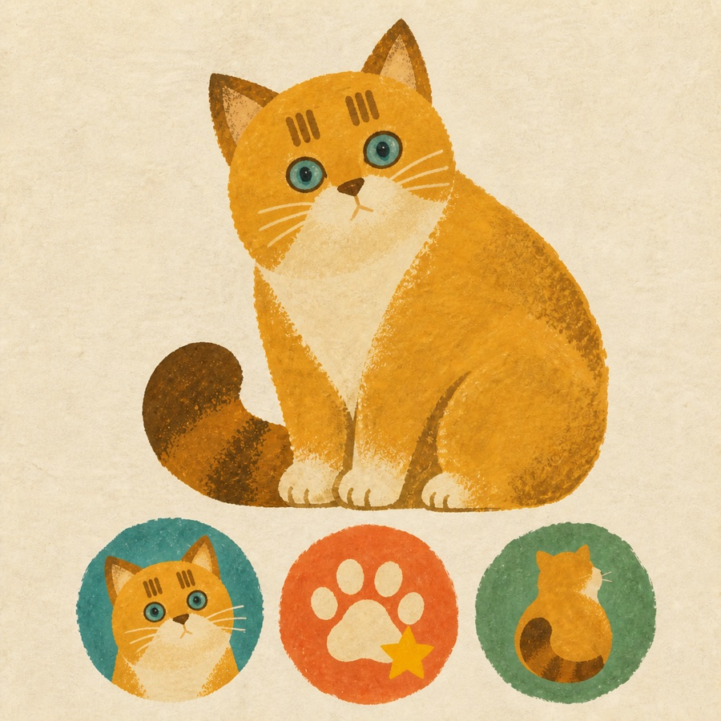

# Wonky Hand-painted Illustration Skill

一个用于生成统一视觉资产的 Codex Skill，风格关键词是：**略粗糙、略笨拙、可爱但不幼稚**。

它不绑定某一种动物或固定角色，而是先提取主体的身份特征，再用稚拙造型、有限色块与干涩手绘笔触建立可复用的视觉语言。适合需要角色系列、成就系统或完整 APP 插画体系的项目。

## 风格参考



这张图是**风格锚点，不是固定猫角色模板**。使用时只借鉴粗拙轮廓、扁平色块、手绘肌理、克制夸张和资产系列一致性，不复制其中的猫、配色或构图。用户提供的角色照片或其他身份资料应作为“身份参考”，与这张“风格参考”分开使用。

## 核心设计语言

- **稚拙造型**：轮廓略歪、略钝、不完全对称，像手画或手剪，而不是精密矢量图。
- **克制夸张**：每个主体只突出一个主要特征，例如大身体、短腿、长耳朵或粗尾巴。
- **平面手绘**：通常使用 3–6 个平面色块，以及干水粉、蜡笔、油画棒或粗铅笔质感。
- **真实笔触**：允许轻微漏白、覆盖不均和色块错位；避免用全图统一噪点伪装手绘。
- **成熟童趣**：可爱来自动作、轮廓与性格，不依赖巨眼、腮红、婴儿比例或装饰堆砌。
- **身份优先**：物种、类别、脸型、花纹位置、结构和关键道具的准确性高于风格化。
- **系列一致**：共享色板、深色替代色、纹理密度、轮廓抖动幅度与夸张尺度。

## 支持的资产类型

1. **角色形象**：动物、人物、物件拟人角色、头像与角色卡。
2. **成就徽章**：小尺寸成就图标、等级徽章与游戏化奖励系统。
3. **APP Icon**：面向平台裁切和小尺寸识别重新构图的应用图标。
4. **单幅或场景插画**：包含主叙事动作、关键道具与少量环境线索的产品插画。

每种资产都有独立的构图、简化、小尺寸适配与质量检查规则。

## 目录结构

```text
wonky-handpainted-illustration/
├── SKILL.md
├── agents/
│   └── openai.yaml
├── assets/
│   └── style-reference.jpg
└── references/
    ├── asset-modes.md
    ├── design-language.md
    ├── prompt-recipes.md
    └── qa-checklist.md
```

仓库根目录就是完整的 Skill 目录，无需再进入下一层文件夹。

## 安装

直接克隆到 Codex 的 skills 目录：

```bash
git clone https://github.com/shiftsheep/wonky-handpainted-illustration.git \
  ~/.codex/skills/wonky-handpainted-illustration
```

也可以下载或克隆本仓库后，将**整个仓库根目录**复制到：

```text
~/.codex/skills/wonky-handpainted-illustration
```

安装完成后重新开始一个 Codex 会话，使 Skill 被发现。

## 使用

在请求中显式调用 Skill：

```text
使用 $wonky-handpainted-illustration，为我的 APP 生成一组统一风格的动物角色、成就徽章、APP Icon 和场景插画。
```

也可以只生成一种资产：

```text
使用 $wonky-handpainted-illustration，生成一枚“连续阅读 7 天”的水獭成就徽章，最终显示尺寸为 48 × 48 px。
```

## 变量示例

Skill 会先明确生成变量，再组织提示词。例如：

```yaml
模式: 成就徽章
主体: 抱着一本书的水獭
物种/类别: 水獭
品种/子类: 无
身份特征: 扁圆脑袋、短耳朵、粗尾巴、淡定神态
用途与交付: 阅读 APP；48 × 48 px；PNG；透明背景；需要系列化
```

如果提供了参考图，Skill 会区分“身份参考”和“风格参考”，避免把无关背景、构图或细节带入成品。迭代时每轮只改变一个视觉变量，锁定已经确认的部分。

## License

本项目采用 [MIT License](LICENSE)。
